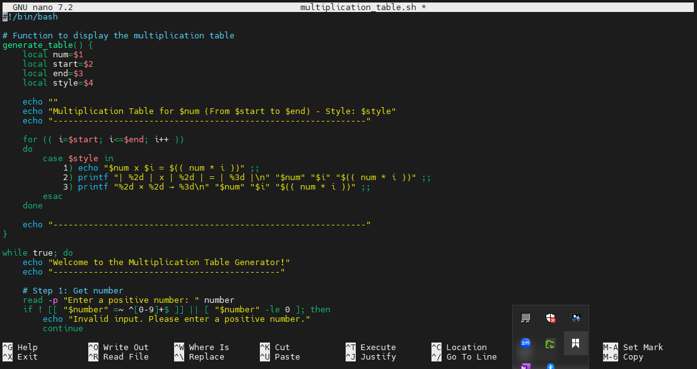
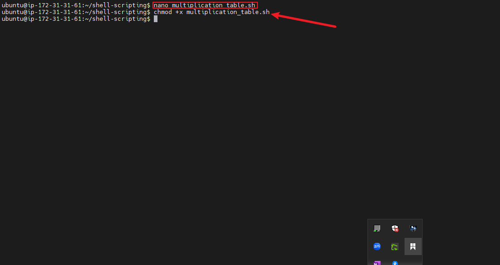
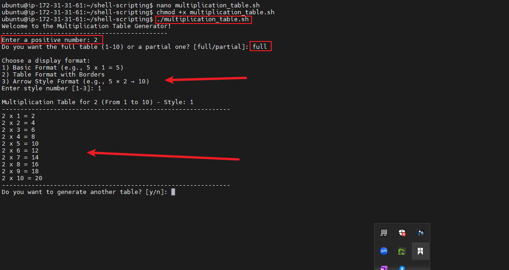
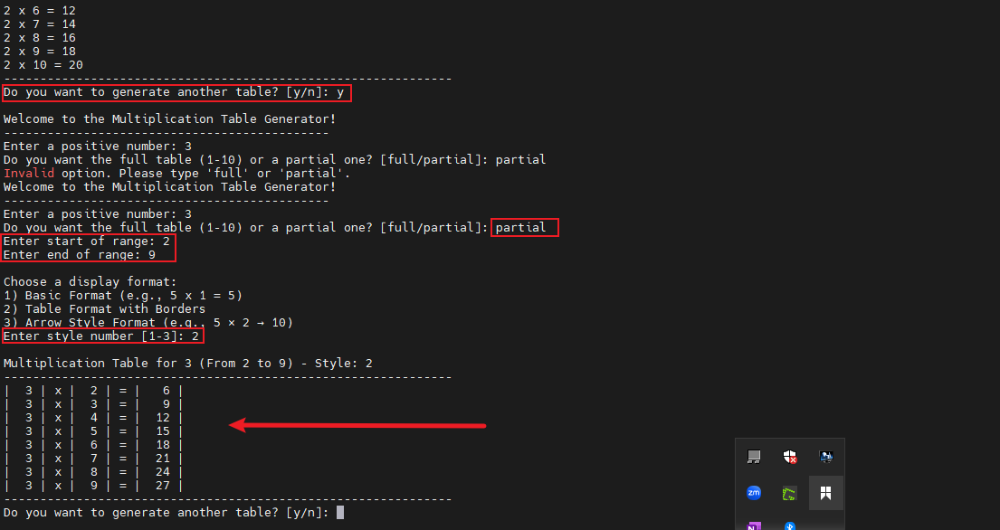

# CAPSTONE PROJECT: Bash Script for Generating a Multiplication Table

### Summarizing the concept of loop functions in bash scripting
Create a bash script that generates a multiplication table for a number entered by the user. This project will help practice using loops, handling user input, and applying conditional logic in bash scripting.

### Writing the script using nano editor

### Changing the file permissions

### Running the first demo

### Running the partial table view with set of ranges

