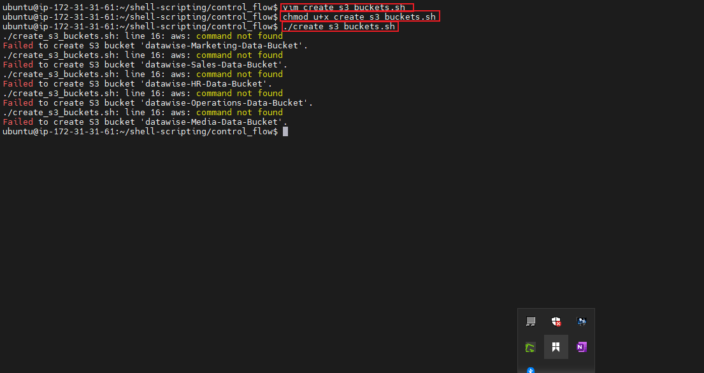

# Error Handling in shell Scripting

### Summarizing the concept of error handling
Error handling is an integral aspect of shell scripting. It requires a clear understanding of the errors, it sources and behaviour during scripting. Identifying potentials errors and proper documentations are key to adequate error management in shell scripting.

### Create S3 Bucket Script Sample

### Create S3 Bucket Demo

