# Advanced Linux Commands

### The ls -latr command
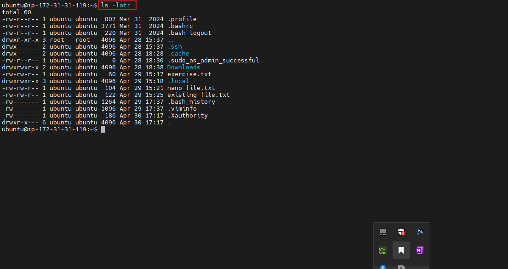

### The chmod command
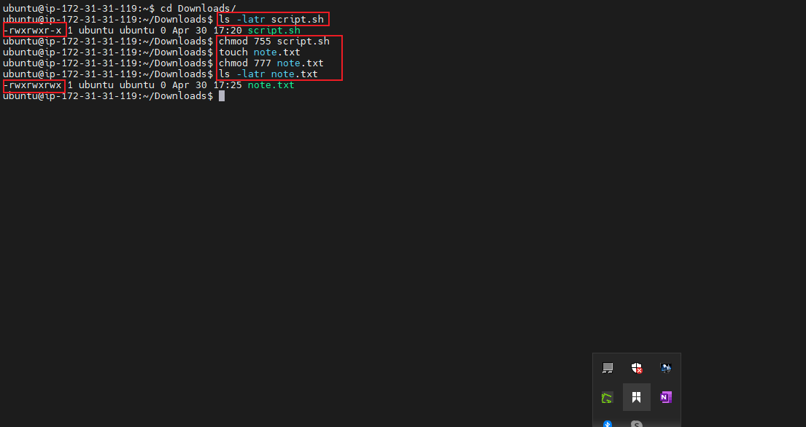

### The group permissions
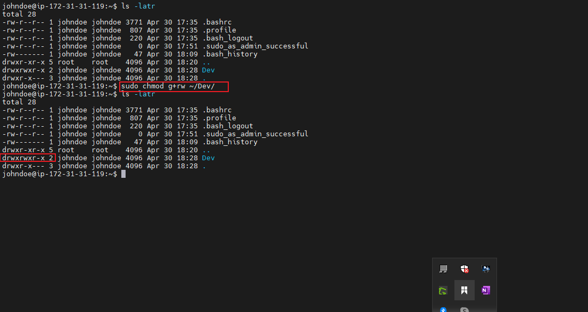

### Creating a new user john doe
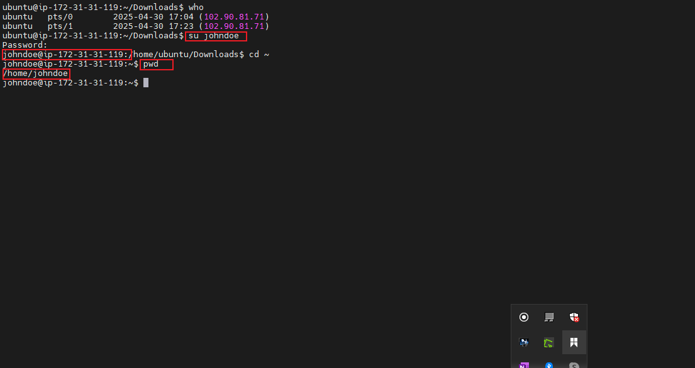

### The John Doe User
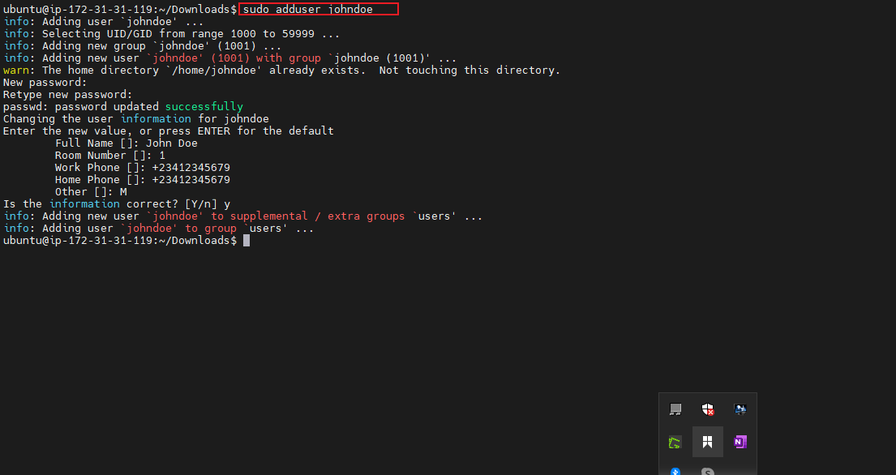

### John Doe New password
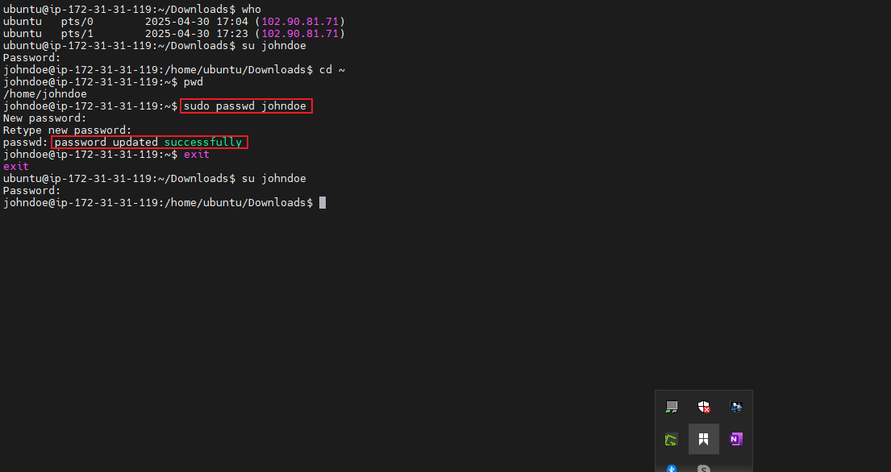

### The DevOPs group
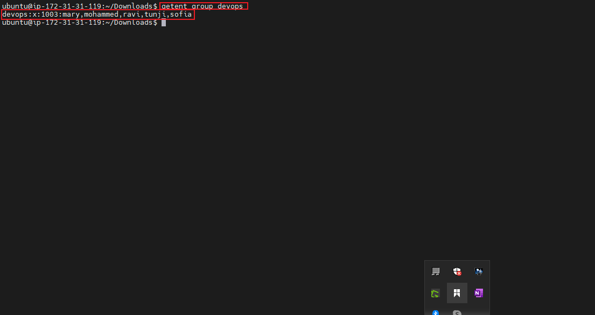

### The Mary User
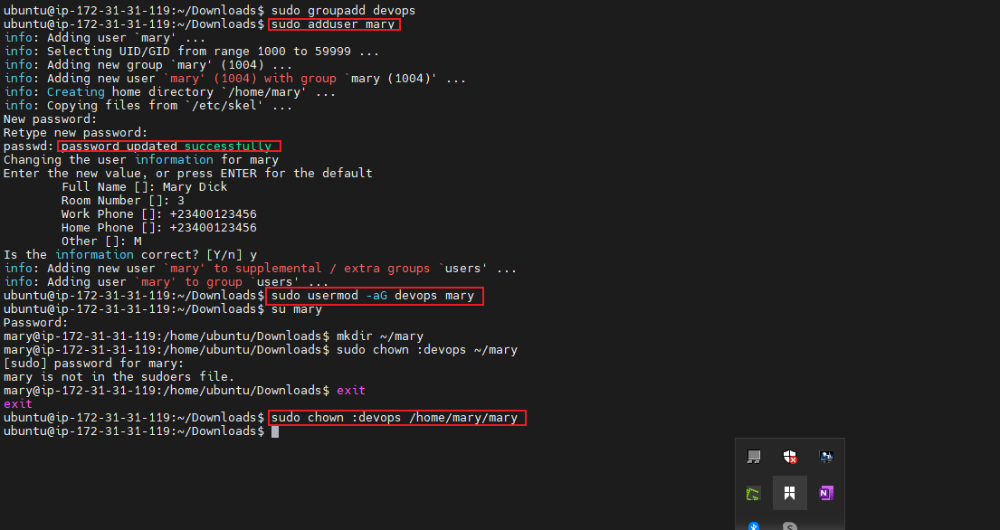

### The Mohammed User
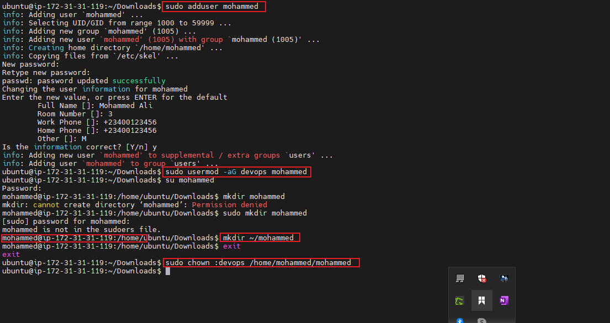

### The Ravi User
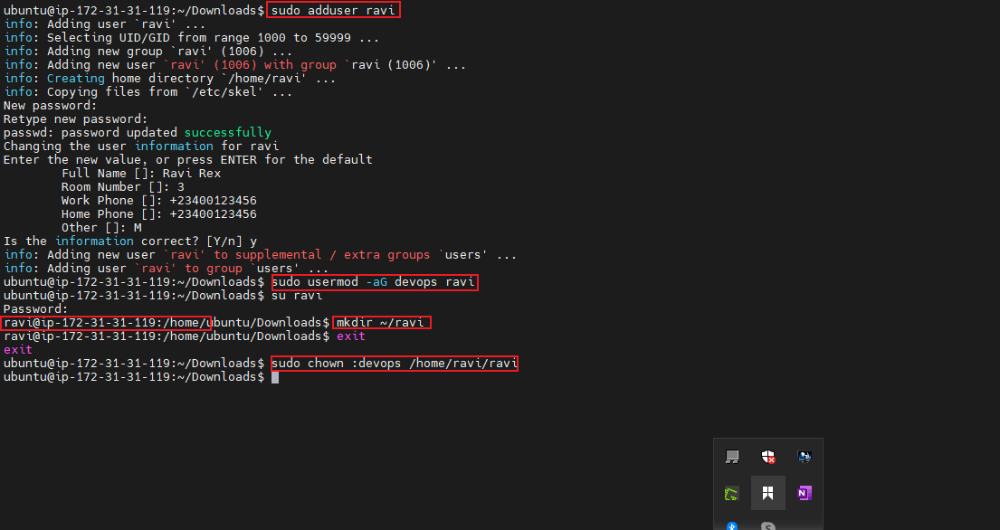

### The Tunji User
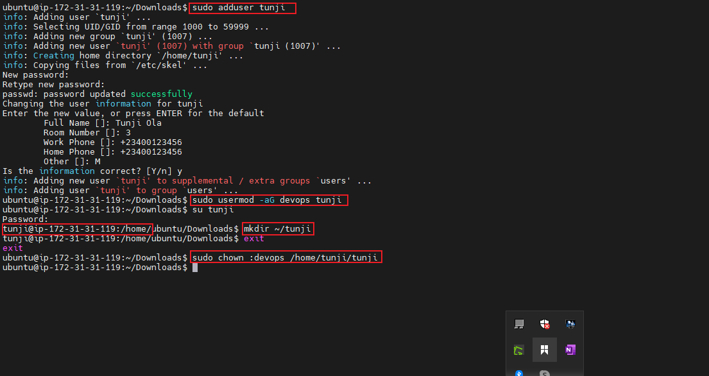

### The Sofia User
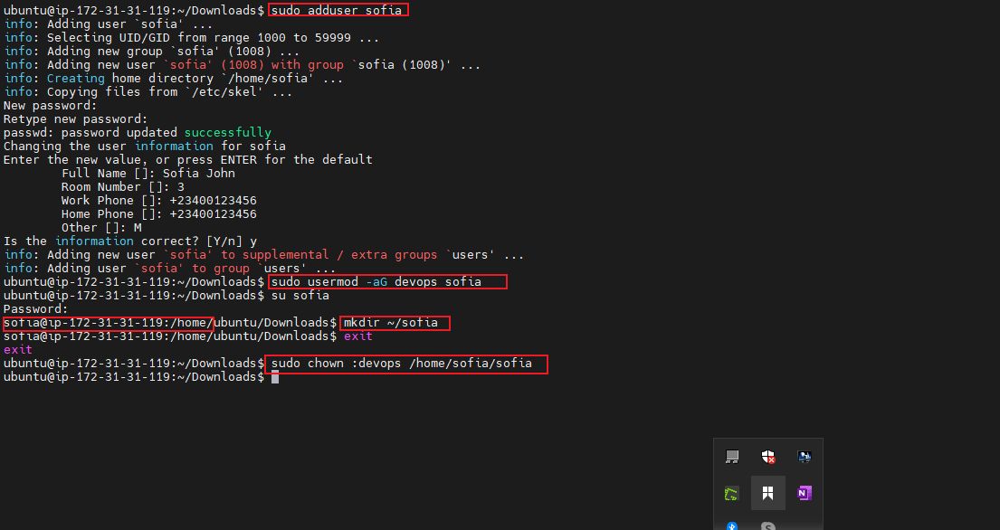

