# Linux fundamentals

### The AWS Console
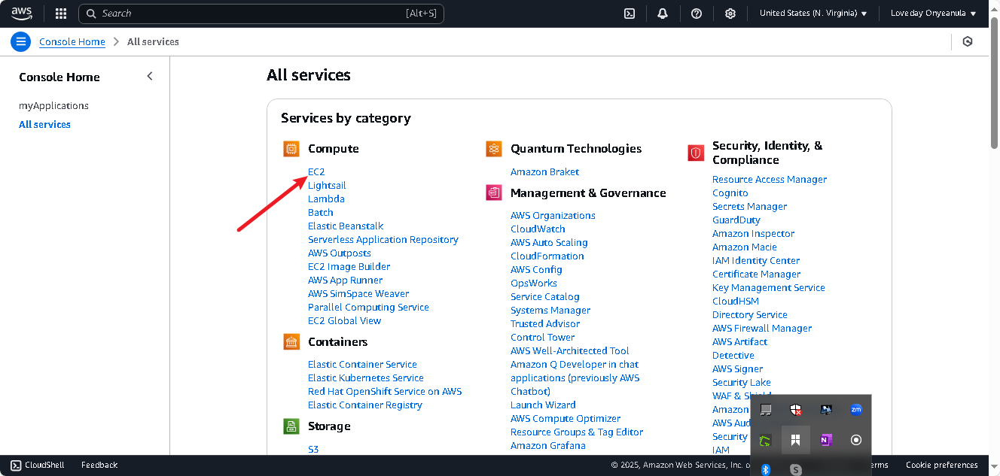

### Launching EC2 Instance
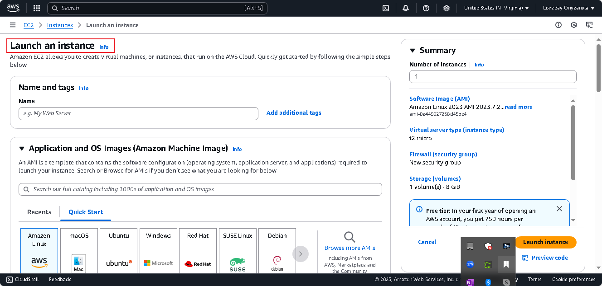

### MobaXterm Installed
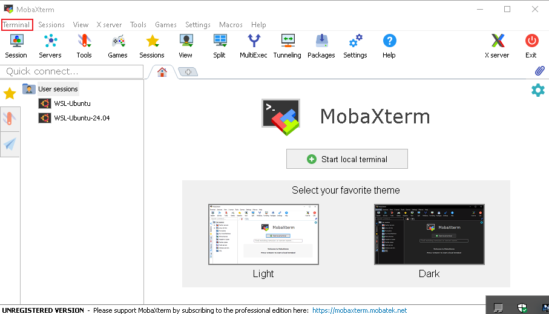

### MobaXterm Terminal
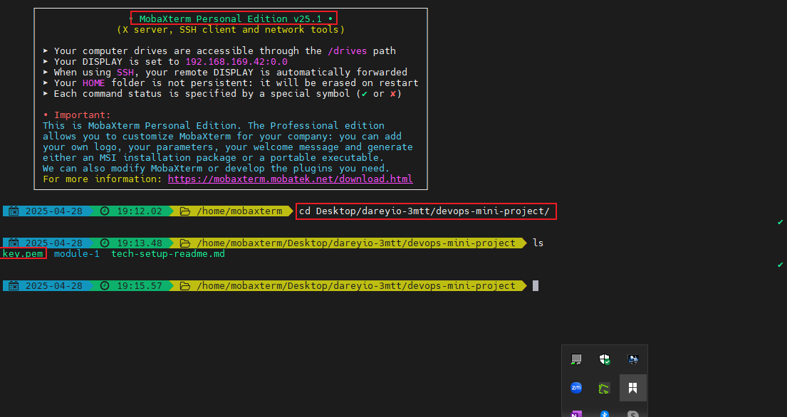

### AWS EC2 Instance Console
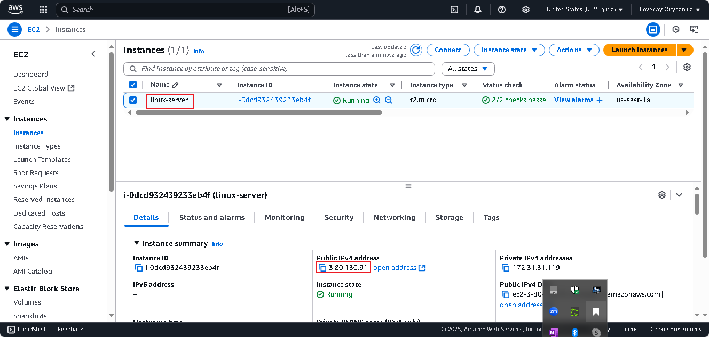

### SSH into the terminal
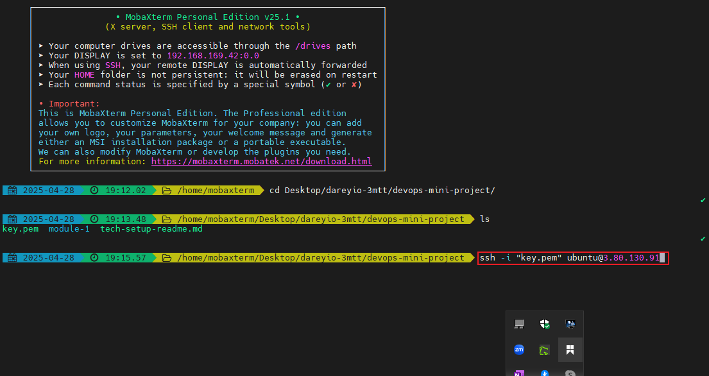

### Now into the linux server via SSH
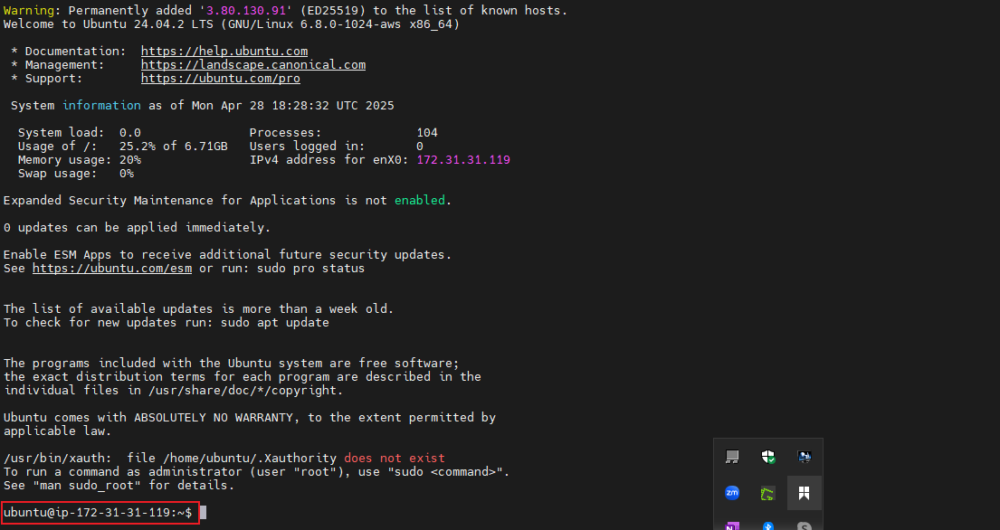

### Apt update command
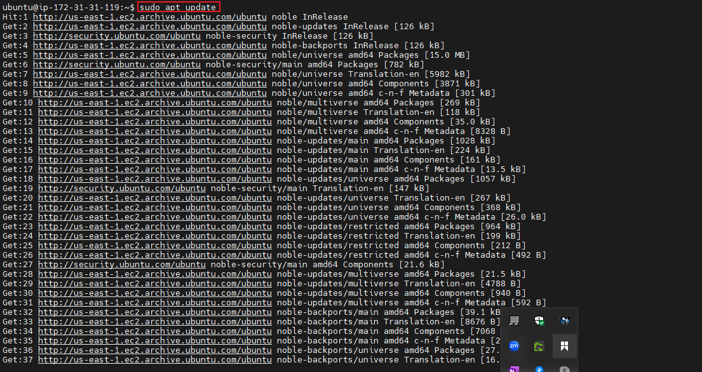

### Apt install tree command
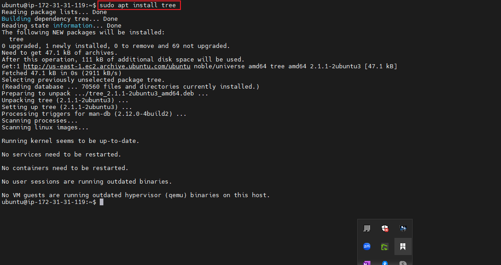

### Running the tree command
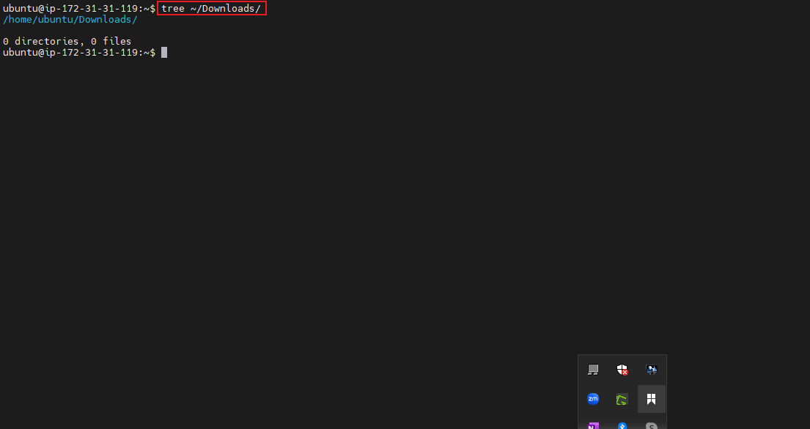

### Running the remove tree command
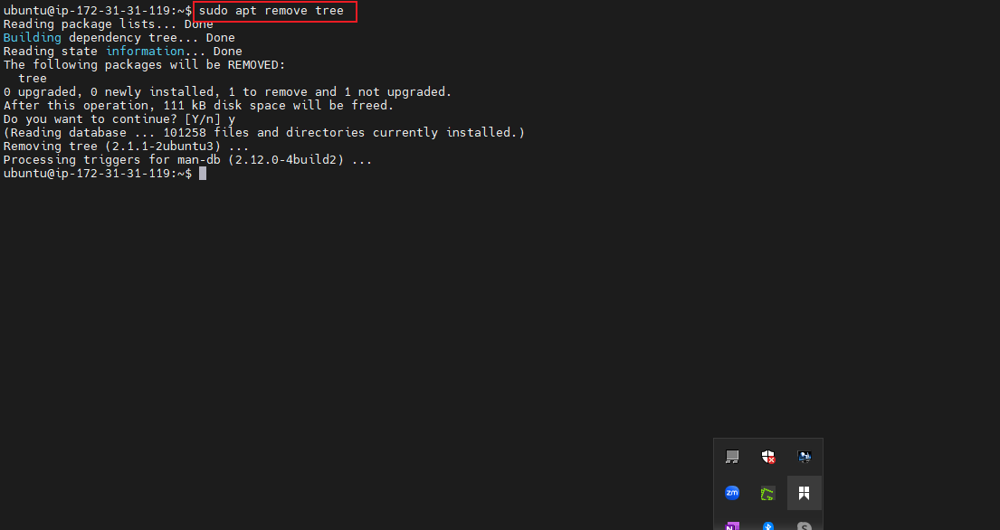

### Apt upgrade command
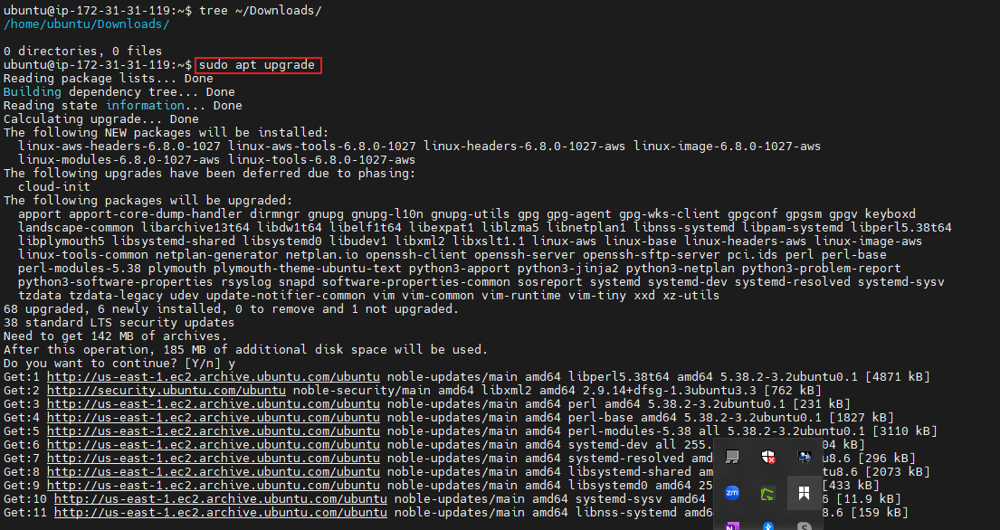

### Running Apt install Apache command as an example
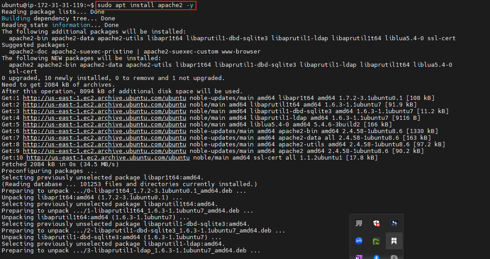

