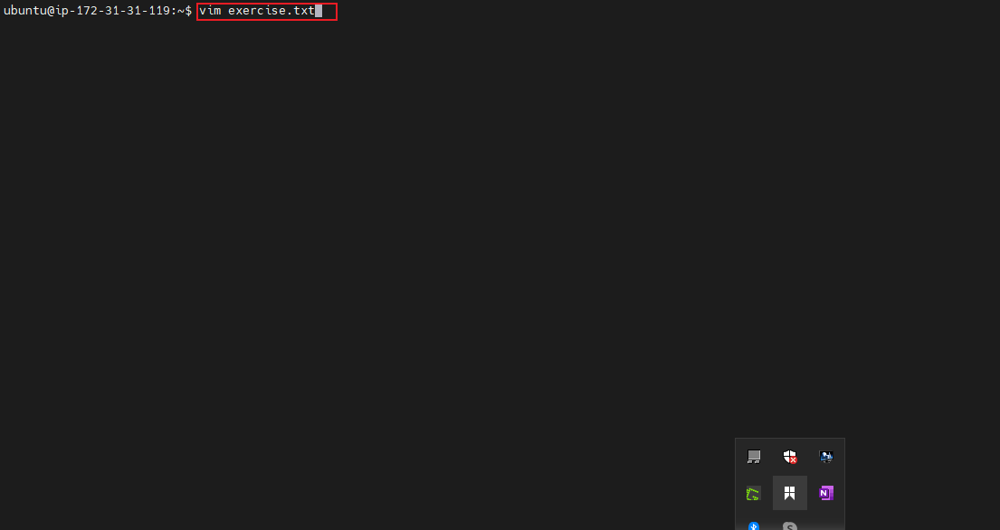
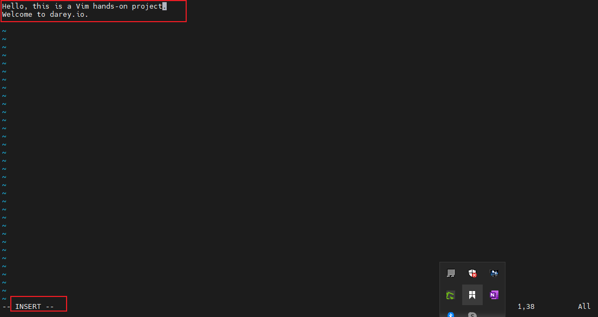
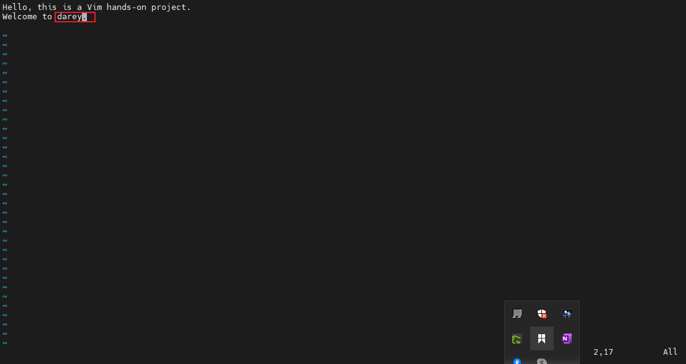
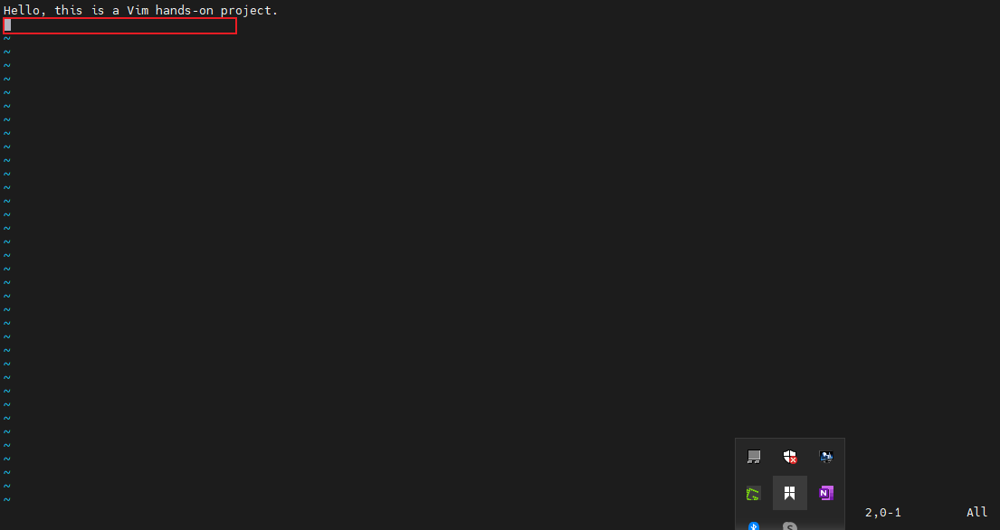
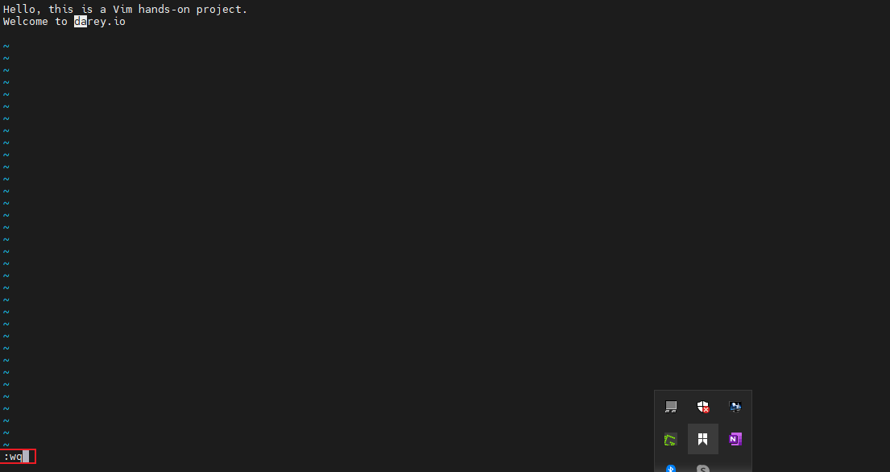
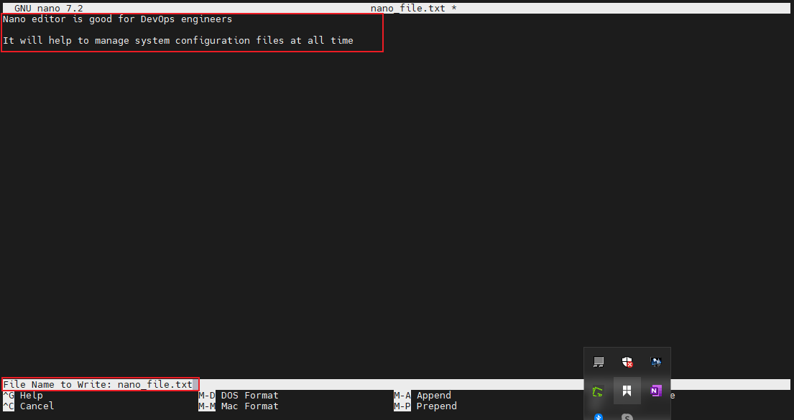
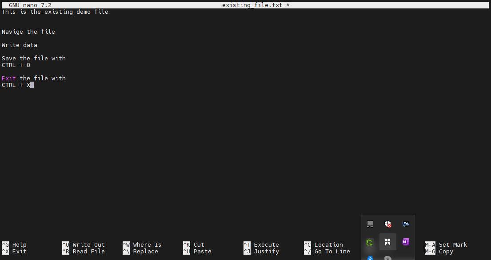
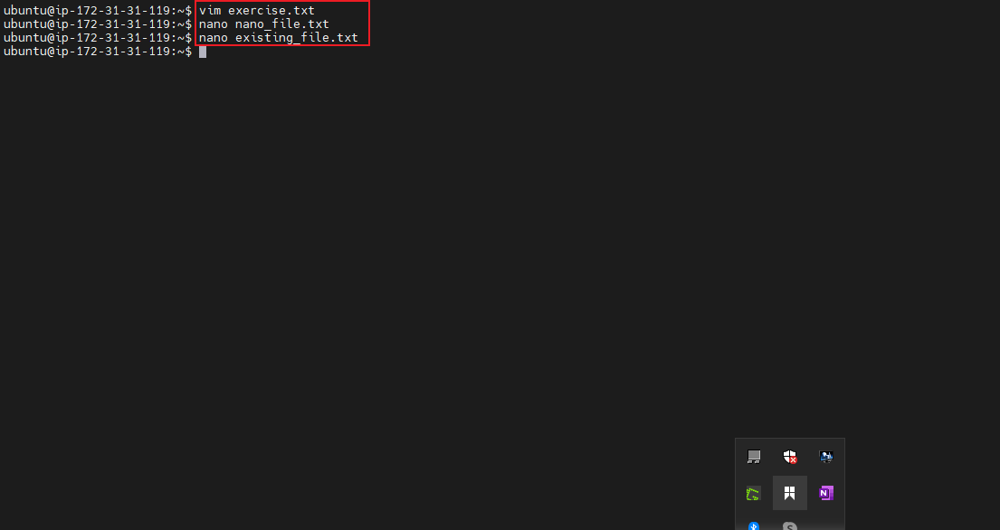

# Linux Text Editor

### Ope a new file using the vim command

### Navigating through the editor

### Delete a Character by pressing the X key in the Normal mode

### Delete a Line of Characters by pressing the D key double times in the Normal mode

### Undo the changes

### Using the Nano Editor

### Opening an Existing File

### All work is now done on the terminal

